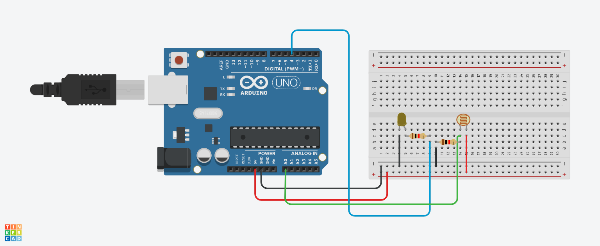

 #POSTE INTELIGENTE 

 #Introdução 

 Este projeto foi desenvolvido dentro do tinkercad, na disciplina de Internet das Coisas (IOT), é um poste normal, se ele sentir luz, ele acende e se não sentir, ele apaga. 

 #COMPONENTES USADOS

- 1 Arduino Uno
- 2 Resistor de 1 kOhms
- 1 Placa de Ensaio
- 1 Led
- 6 Jumpers Macho-Macho
- 1 Fotorresistor

  #EXPLICAÇÃO DO CÓDIGO

  //variaveis
  
int led =3;
int sensorluminosidade = A0;

// variavel para capturar a luminosidade

int luz =0; 

void setup()
{
  // led é de saida
  pinMode(led,OUTPUT);
  
  // sensor é de entrada
  pinMode(sensorluminosidade,INPUT);
}

void loop()
{
  // capturar o que o sensor leu no ambiente
  // analogRead é usado para leitura analogica
  
  luz = analogRead(sensorluminosidade);
  
  /* as portas analogicas capturam dados que variam
   de 0 até 1023 */
  
  // SE ESTIVER COM POUCA LUZ NO AMBIENTE
  
  if(luz<500){
   // digitalWrite(led,HIGH); // LIGAR LED
    
   // passar ao led intensidade maxima
    analogWrite(led,1023); 
    
  }if(luz>500 & luz<900){
  
   // passar ao led intensidade média
    analogWrite(led,500); 
    
  }else{ // SE TIVER LUZ
    // digitalWrite(led,LOW); // DESLIGAR LED
  
  // passar ao led intensidade minima
    analogWrite(led,0);
  
  }
  
}

#MONTAGEM DO CIRCUITO

  
