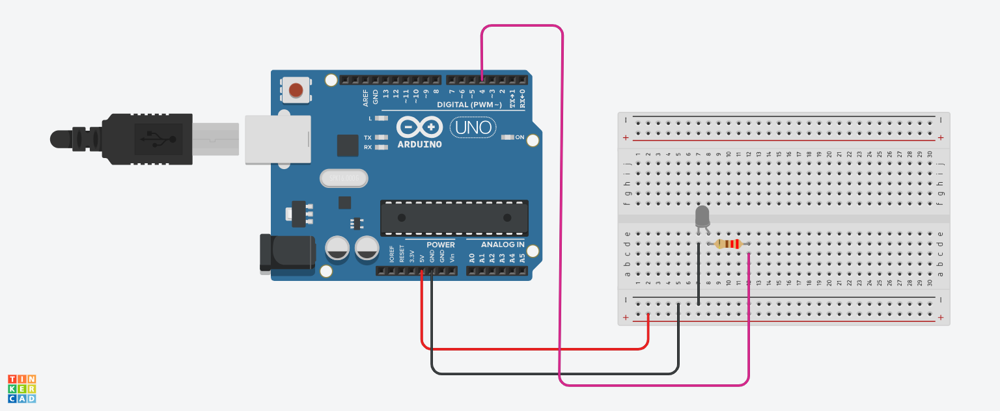

#LED

#INTRODUÇÃO

Este projeto foi desenvolvido dentro do tinkercad, na disciplina de Internet das Coisas (IOT), para a criação de um prototipo com arduino de led que acende e apaga.

#COMPONENTES USADOS

- 1 Arduino Uno
- 1 Resistor de 1 kOhms
- 1 Placa de Ensaio
- 1 Led 
- 4 Jumpers Macho-Macho

#EXPLICAÇÃO DO CÓDIGO 

//variavel para capturar a porta de conexão do led int led = 4;

//configuração inicial roda uma vez no início 
void setup() 

//definir configuração do led INPUT (entrada) OUTPUT (saída)
{ 
  pinMode(led, OUTPUT); //defini o led como saída 
  
/*
função de definição de entrada/saida do equipamento 
receber 2 parametros:
(ports que o dispositivo esta conectado,OUTPUT)
*/
  }

//função de execução de instruções infinitas/loop
void loop()

{ 
  //ligar o meu led, para ligar usa-se (HIGH) 
  digitalWrite(led,HIGH);
  
  //adicionar uma pausa 
  delay(2000); // espere 2 segundos com led ligado
  
  // desligar o led, usa-se (LOW)
  digitalWrite(led,LOW);
  
  delay(2000); // espere 2 segundos com led desligado

}

#MONTAGEM DO CIRCUITO

