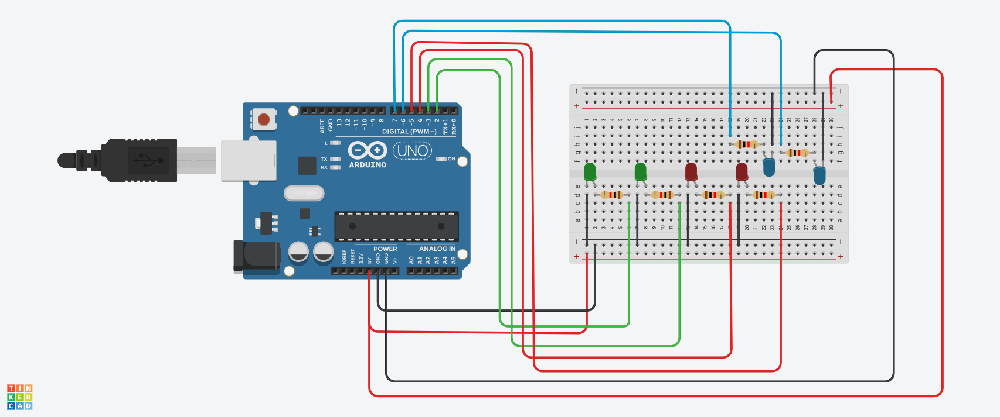

# LEDS PISCANTES

#INTRODUÇÃO 

Este projeto foi desenvolvido dentro do tinkercad, na disciplina de Internet das Coisas (IOT), para a criação de um sistema de controle de LEDs que acende os leds em uma sequência especificada. 
O desafio era: 

CRIE UM CIRCUITO COM 2 LEDS VERDES , 2 LEDS VERMELHOS E 2 LES AZUIS. (NESSA OREDEM)

- NO PRIMIRO MOMENTO DEVE SER ACESO 1 LED VERDE, 1 VEREMLHO, 1 AZUL.
- NO SEGUNDO MOMENTO DEVE SER ACESO 2 AZUIS E 2 VERDES
- NO TERCEIRO MOMENTO DEV SER ACESO 1 VERDE , 2 VERMELHOS E 1 AZUL.

#COMPONENTES USADOS

- 1 Arduino Uno
- 1 Placa de Ensaio
- 6 Resistores de 1 kOhms
- 6 Leds (2 verdes, 2 vermemlhos e 2 azuis)
- 16 Jumpers Macho-Macho

#EXPLICAÇÃO DO CÓDIGO

Função setup(): Nesta função, todos os pinos dos LEDs são configurados como saídas (OUTPUT), permitindo que o Arduino controle a alimentação dos LEDs.

A função loop() é onde a lógica de controle dos LEDs acontece. Ele que acende e apaga os leds.

As variáveis ledVerde1 = 2; ledVerde2 = 3; ledVermelho1 = 4; ledVermelho2 = 5; ledAzul1 = 6; ledAzul2 = 7 são usadas para guardar a numerção dos pinos na qual os leds estão conectados no arduino.

#MONTAGEM DO CIRCUITO

