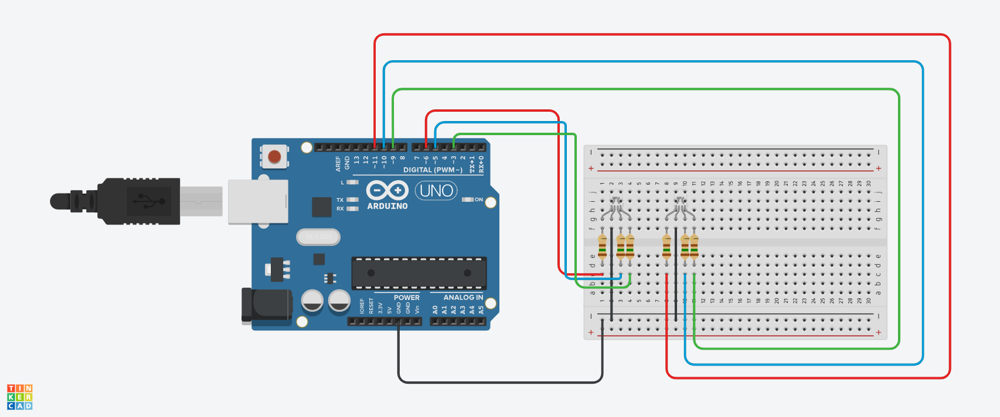

# RGBD

#INTRODUÇÃO 

Este projeto foi desenvolvido dentro do tinkercad, na disciplina de Internet das Coisas (IOT), para a criação de um prototipo com arduino de led que acende e apaga no estilo luzes de natal.

#COMPONENTES USADOS

- 1 Arduino Uno
- 6 Resistores de 1 kOhms
- 1 Placa de Ensaio
- 2 Leds RGB
- 9 Jumpers Macho-Macho

#EXPLICAÇÃO DO CÓDIGO

int R = 6;//PORTA VERMELHA 

int G = 3;//PORTA VERDE

int B = 5;//PORTA AZUL 

int R1 = 11;//PORTA VERMELHA 

int G2 = 9;//PORTA VERDE

int B3 = 10;//PORTA AZUL 
  
void setup()
{
  pinMode(R,OUTPUT);
  pinMode(G,OUTPUT);
  pinMode(B,OUTPUT);
  pinMode(R1,OUTPUT);
  pinMode(G2,OUTPUT);
  pinMode(B3,OUTPUT);
  
}

void loop()
{
  //geração de números aleatórios 

  int v1 = random(0,255);
  int v2 = random(0,255);
  int v3 = random(0,255);
  
  
 analogWrite(R,v1); //QUALQUER VALOR DE 0 A 255

 analogWrite(G,v2); //QUALQUER VALOR DE 0 A 255

 analogWrite(B,v3); //QUALQUER VALOR DE 0 A 255

 delay(50); //ESPERE 5 SEGUNDOS 

  int p1 = random(0,255);
  int p2 = random(0,255);
  int p3 = random(0,255);

  
 analogWrite(R1,p1); //QUALQUER VALOR DE 0 A 255

 analogWrite(G2,p2); //QUALQUER VALOR DE 0 A 255

 analogWrite(B3,p3); //QUALQUER VALOR DE 0 A 255

 delay(50); //ESPERE 5 SEGUNDOS

#MONTAGEM DO CIRCUITO

  
