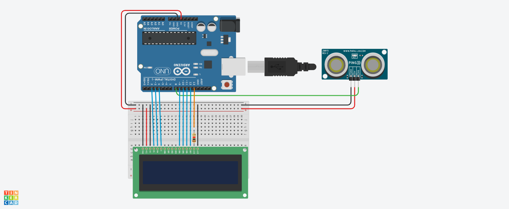

#Projeto de Tela LCD com sensor de Distância 

Este projeto foi desenvolvido dentro do tinkercad, na disciplina de Internet das Coisas (IOT), para a criação de um prototipo com arduino que simule uma mensagem de Mantenha distância toda vez que alguém se 
aproximar a menos de 1 metro do sensor.

## Componentes Usados 
- 1 Arduino Uno 
- 1 Resistor de 1 kOhms
- 1 Placa de Ensaio
- 1 Placa LCD 16x2
- 1 Sensor de Distância
- 14 Jumpers Macho-Macho
- 3 Jumpers Macho-Fêmea

## Montagem do Circuito

## Explicação do Código 

Importando a biblioteca do LCD

#include <LiquidCrystal.h>

LiquidCrystal lcd(2, 3, 4, 9, 10, 11, 12);
int ledLcd = 13;

Metodo para capturar a distancia e retorna o valor para o arduino.

long distancia(int trigger, int echo){
  
  pinMode(trigger, OUTPUT);
  digitalWrite(trigger,LOW);
  delay(5);
 
  digitalWrite(trigger,HIGH);
  delay(10);
  digitalWrite(trigger,LOW);
  
  pinMode(echo,INPUT);
  
  return pulseIn(echo,HIGH);
 
}

void setup()
{
  pinMode(ledLcd, OUTPUT); 
  digitalWrite(ledLcd, HIGH); 
  lcd.begin(16,2); 
  lcd.clear(); 
}

Metodo para executar infinitamente o código de conversão da distância para cm, e impressão das mensagens de "Mantenha Distância".

void loop()
{

  int cm = 0.01723 * distancia(8, 8);
 
  if(cm<100){
    lcd.setCursor(0,0);
    lcd.print("MANTENHA");
    lcd.setCursor(0,1);
    lcd.print("DISTANCIA");
  }else{
    lcd.clear();
  }
  
}
  
