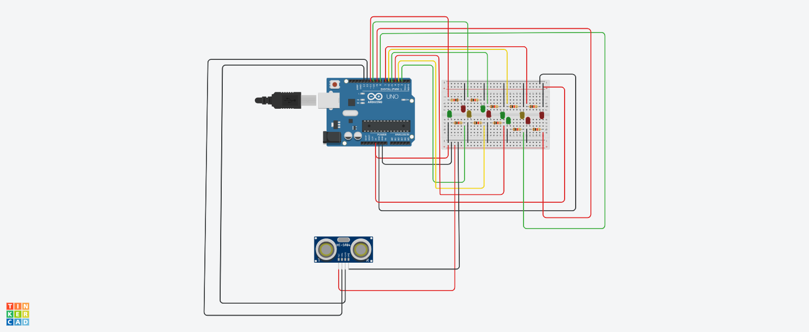

# SEMÁFORO INTELIGENTE 

#INTRODUÇAO 

Projeto visa criar um semáforo que está localizado em duas vias da cidade e possui uma faixa d pedreste passando por elas. 
O desafio era: 
Você foi contratado por uma empresa para a criação e instalação de um semáforo inteligente em Araguaína. O semáforo será instalado em um rodovia com pista dupla, e ambas tem 1 faixa de pedestre que atravessa elas. Seu dever é:

- Criar 2 semáforos para carros usando leds (verde, amarelo, vermelho), considerando que cada pista tem um sentido diferente.
- criar 2 semáforos para pedestres usando leds (vermelho e verde), um para cada pista.
- Os semáforos de carros ficaram sempre no verde , até que um pedestre chegue próximo da faixa de pedestre.
- ao chegar próximo a faixa de pedestre, um sensor de distancia é acionado (50cm), e logo em seguida todos os sinais de carro ficarão vermelhos.
- durante 15 segundos os 2 semáforos de pedestres ficarão verde.
- quando o sensor não detectar mais nenhum pedestre , os sinais de pedestre ficarão vermelho e os semáforos dos carros abrirá.

- #COMPONENTES USADOS

- 1 Arduino Uno
- 10 Resistores de 1 kOhms
- 1 Placa de Ensaio
- 10 Leds (4 verdes, 4 vermelhos e 2 amarelos)
- 28 Jumpers Macho-Macho
- 1 Sensor de distância ultrassônico

  
  

#EXPLICAÇÃO DO CÓDIGO

// Definindo os pinos para o sensor de distância

const int trigPin = 12;
const int echoPin = 13;

// Definindo os pinos para os LEDs dos semáforos de carros

const int carro1Verde = 2;
const int carro1Amarelo = 3;
const int carro1Vermelho = 4;
const int carro2Verde = 5;
const int carro2Amarelo = 6;
const int carro2Vermelho = 7;

// Definindo os pinos para os LEDs dos semáforos de pedestres

const int pedestre1Verde = 8;
const int pedestre1Vermelho = 9;
const int pedestre2Verde = 10;
const int pedestre2Vermelho = 11;

  // Configurando o pino do Trigger do sensor como saída

  // Configurando o pino do Echo do sensor como entrada

void setup() {
  pinMode(trigPin, OUTPUT);
  pinMode(echoPin, INPUT);
  pinMode(carro1Verde, OUTPUT);
  pinMode(carro1Amarelo, OUTPUT);
  pinMode(carro1Vermelho, OUTPUT);
  pinMode(carro2Verde, OUTPUT);
  pinMode(carro2Amarelo, OUTPUT);
  pinMode(carro2Vermelho, OUTPUT);
  pinMode(pedestre1Verde, OUTPUT);
  pinMode(pedestre1Vermelho, OUTPUT);
  pinMode(pedestre2Verde, OUTPUT);
  pinMode(pedestre2Vermelho, OUTPUT);

  // Inicializa semáforos dos carros como verdes
  
  digitalWrite(carro1Verde, HIGH);
  digitalWrite(carro2Verde, HIGH);
  digitalWrite(carro1Vermelho, LOW);
  digitalWrite(carro2Vermelho, LOW);
  digitalWrite(pedestre1Verde, LOW);
  digitalWrite(pedestre2Verde, LOW);
  digitalWrite(pedestre1Vermelho, HIGH);
  digitalWrite(pedestre2Vermelho, HIGH);
}

void loop() {
  long duration, distance;
  
  // Envia um pulso para o sensor
  
  digitalWrite(trigPin, LOW);
  delayMicroseconds(2);
  digitalWrite(trigPin, HIGH);
  delayMicroseconds(10);
  digitalWrite(trigPin, LOW);
  
  // Lê o tempo de retorno do pulso
  
  duration = pulseIn(echoPin, HIGH);
  
  // Calcula a distância em centímetros
  
  distance = (duration / 2) / 29.1;

  // Verifica se um pedestre está próximo (menor que 50 cm)
  
  if (distance < 50) {
    
   //Pedestres próximos, interrompe os carros
    //Acende o sinal amarelo primeiro
    
  digitalWrite(carro1Verde, LOW);
  digitalWrite(carro2Verde, LOW);
  digitalWrite(carro1Amarelo, HIGH);
  digitalWrite(carro2Amarelo, HIGH);
  delay(2000);  // Sinal amarelo por 2 segundos
    
  // Então, sinal vermelho
    
  digitalWrite(carro1Amarelo, LOW);
  digitalWrite(carro2Amarelo, LOW);
  digitalWrite(carro1Vermelho, HIGH);
  digitalWrite(carro2Vermelho, HIGH);
    
  // Acende os semáforos de pedestre
    
  digitalWrite(pedestre1Verde, HIGH);
  digitalWrite(pedestre2Verde, HIGH);
  digitalWrite(pedestre1Vermelho, LOW);
  digitalWrite(pedestre2Vermelho, LOW);
    
  delay(15000); // Semáforos de pedestre verdes por 15 segundos

  // Após 15 segundos, desligar os verdes
    
  digitalWrite(pedestre1Verde, LOW);
  digitalWrite(pedestre2Verde, LOW);
  digitalWrite(pedestre1Vermelho, HIGH);
  digitalWrite(pedestre2Vermelho, HIGH);
  } else {
    
  // Não há pedestres, permite que os carros sigam
    
  digitalWrite(carro1Verde, HIGH);
  digitalWrite(carro2Verde, HIGH);
  digitalWrite(carro1Vermelho, LOW);
  digitalWrite(carro2Vermelho, LOW);
  }
}

