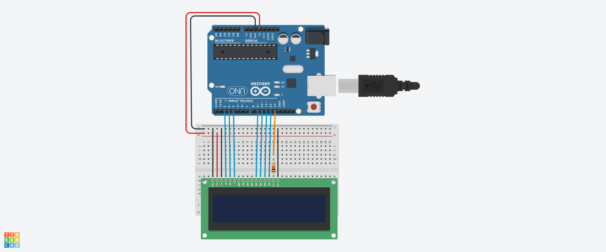

# TELA LCD

#INTRODUÇAO

Este projeto foi desenvolvido dentro do tinkercad, na disciplina de Internet das Coisas (IOT), para a criação de um prototipo com arduino que aparece uma mensagem. 

#Componentes Usados

- 1 Arduino Uno
- 1 Resistor de 1 kOhms
- 1 Placa de Ensaio
- 1 Placa LCD 16x2
- 14 Jumpers Macho-Macho

#EXPLICAÇÃO DO CÓDIGO 

//biblioteca do LCD 

#include <LiquidCrystal.h>

//criar variavel do lcd

LiquidCrystal lcd (2,3,4,9,10,11,12);

int ledlcd = 13;

void setup()
{
  pinMode(ledlcd,OUTPUT); 
  //DEFINIR LEDLCD SAIDA
  digitalWrite(ledlcd, HIGH);
  //LIGAR OS LEDS DO LCD
  lcd.begin(16,2); 
  //informar que o led tem 16 colunas e 12 linhas
  lcd.clear(); 
  //iniciar o lcd limpo
}

void loop()
{
  lcd.setCursor(0,0); 
  //iniciar a escrita na linha 0 coluna 0 
  lcd.print("BOM DIA");
  lcd.setCursor(0,1); 
  //iniciar a escrita na linha 0 coluna 0 
  lcd.print("TEU CU");
}

