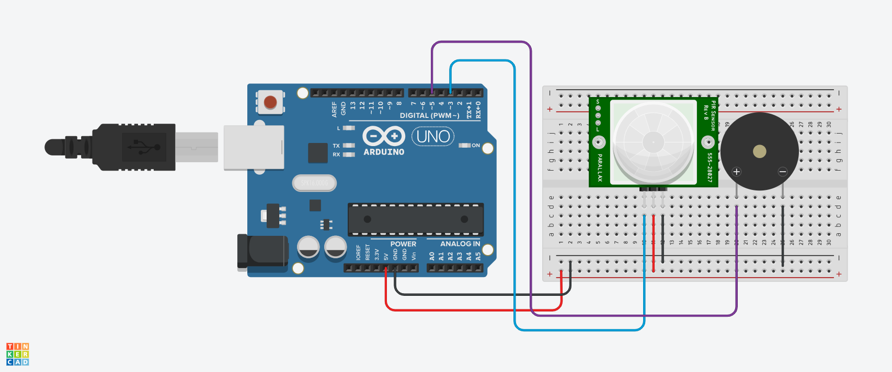

#   ALARME

#INTRODUÇÃO

Este projeto foi desenvolvido dentro do tinkercad, na disciplina de Internet das Coisas (IOT), para a criação de um prototipo com arduino que quado algo ou alguém chega a certa distância 
do sensor, vai ser emitido um alarme. 

#COMPONENTES USADOS

- 1 Arduino Uno
- 1 Placa de Ensaio
- 1 Sensor PIR
- 7 Jumpers Macho-Macho
- 1 Piezo

#EXPLICAÇÃO DO CÓDIGO

// Definindo o pino do sensor PIR e do buzzer

int sensorPIR = 3;  
int buzzer = 5;     

// Função de configuração inicial

void setup()
{
  // Configurando o pino do sensor PIR como entrada
  
  pinMode(sensorPIR, INPUT);
  
  // Configurando o pino do buzzer como saída
  
  pinMode(buzzer, OUTPUT);
}

// Loop principal do programa

void loop()
{
  // Lendo o estado do sensor PIR (movimento detectado ou não)
  
  int detectarPresenca = digitalRead(sensorPIR);
  
  // Se movimento for detectado (estado HIGH)
  
  if(detectarPresenca == 1){
    // Emite um som no buzzer com a frequência de 264 HIGH
    tone(buzzer, 264);
  }else{
    // Se não houver movimento, desliga o som do buzzer
    noTone(buzzer);
  }
}

#MONTAGEM DO CIRCUITO

