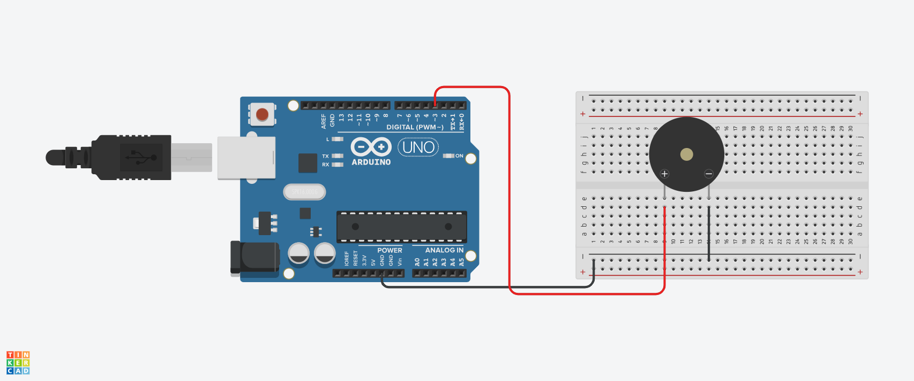

# BUZZER

#INTRODUÇÃO

Este projeto foi desenvolvido dentro do tinkercad, na disciplina de Internet das Coisas (IOT), para a criação de um prototipo com arduino que emite som.

#COMPONENTES USADOS

- 1 Arduino Uno
- 1 Placa de Ensaio
- 1 Piezo
- 3 Jumpers Macho-Macho

#EXPLICAÇÃO DO CÓDIGO

// Definindo o pino do buzzer

int buzzer = 3; 

// Definindo as frequências das notas musicais

#define doo 262 
#define re 294 
#define mi 330  
#define fa 349  

void setup()
{
  // Configurando o pino do buzzer como saída
  pinMode(buzzer, OUTPUT);
}

void loop()
{
  // Toca a nota Dó (C) por 500 ms
  tone(buzzer, doo, 500);
  delay(600); // Aguarda 600 ms antes de tocar a próxima nota

  // Toca a nota Ré (D) por 500 ms
  tone(buzzer, re, 500);
  delay(600); // Aguarda 600 ms antes de tocar a próxima nota

  // Toca a nota Mi (E) por 500 ms
  tone(buzzer, mi, 500);
  delay(600); // Aguarda 600 ms antes de tocar a próxima nota

  // Toca a nota Fá (F) por 500 ms
  tone(buzzer, fa, 500);
  delay(600); // Aguarda 600 ms antes de tocar a próxima nota

  // Para o som do buzzer
  noTone(buzzer);
}

#MONTAGEM DO CIRCUITO

