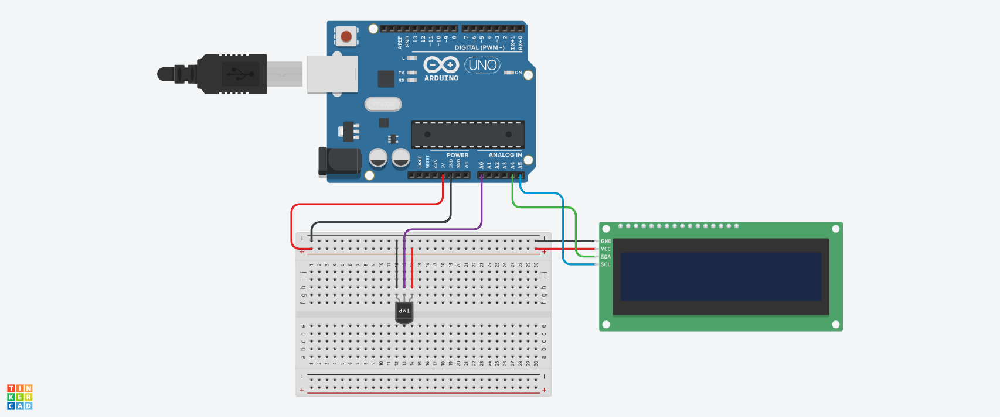

# SENSOR DE TEMPERATURA 

#INTRODUÇÃO

Este projeto foi desenvolvido dentro do tinkercad, na disciplina de Internet das Coisas (IOT), para a criação de um prototipo com arduino que mede a temperatura do ambiente e retorna uma mensagem.

#COMPONENTES USADOS

- 1 Arduino Uno
- 1 Sensor de temperatura 
- 1 Placa de Ensaio
- 9 Jumpers Macho-Macho
- 1 Placa LCD 16X2

  #EXPLICAÇÃO DO CÓDIGO

  //Biblioteca LCD

#include <LiquidCrystal_I2C.H>

LiquidCrsytal_I2C telalcd (0x20,16,2);

//variável para o sensor de temperatura 7

int sensor_tmp = A0;

//capturar temperatura 

int valorido = 0;

void setup()
{
  //definir o sensor como entrada 
  pinMode(sensor_tmp,INPUT);
  //ligar a tela lcd
  telalcd.init();
  //limpar os dados que aparecem 
  telalcd.clear();
  //aumentar a luminosidade do lcd
  telalcd.backlight();

}

void loop()
{
  //capturar o valor da temperatura
  valorido = analogRead (sensor_tmp);
  //converter o valor da tensão 
  float tensao = (valorido*5.0)/1023;
  //converter o valor da tensão em graus celsius 
  float temperatura = (tensao-0.5)*100;
  
  //imprimir valor da temperatura no LCD
  
  telalcd.setCursor(0,0);
  telalcd.print("Temperatura:");
  telalcd.setCursor(0,1);
  telalcd.print(Temperatura);
  telalcd.print(" c");

}

#MONTAGEM DO CIRCUITO 

