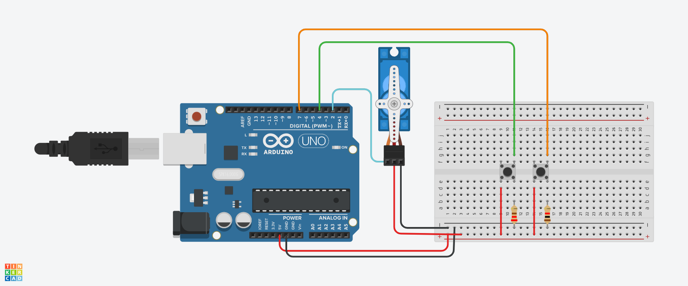

# SERVO MOTOR

#INTRODUÇÃO

Este projeto foi desenvolvido dentro do tinkercad, na disciplina de Internet das Coisas (IOT), para a criação de um prototipo com arduino que gira.

#COMPONENTES USADOS

- 1 Arduino Uno
- 2 Resistor de 1 kOhms
- 1 Placa de Ensaio
- 2 Botões
- 9 Jumpers Macho-Macho
- 1 Micro servo

  #EXPLICAÇÃO DO CÓDIGO

  //biblioteca do servor motor 
#include <Servo.h>
/*criando objeto do tipo Servo Motor para poder usar as funções
de controle do equipamento(servo motor)*/
Servo objetoservo;
//variavel para salvar a porta que o servo está
int servo=2;
//variavel para porta do botão
int botao=4;
int botaovoltar=7;

//variavel para posição do motor
int posicao =0;

void setup()
{
  // a inicialização do servo na porta digital 2
  objetoservo.attach(servo);
  //SERVO COMEÇA NA POSIÇÃO 0
  objetoservo.write(0);
  //definir botão como entrada
  pinMode(botao,INPUT);
  pinMode(botaovoltar,INPUT);
}

void loop()
{
  /*SE BOTÃO FOR PRESSIONADO E POSIÇÃO DO SERVO MOTOR ESTIVER
  MENOR QUE 180°*/
  
  if (digitalRead(botao)== HIGH && posicao<180 ){
    // ENTÃO AUMENTE 1° DE POSIÇÃO
      posicao++;
    //MANDE O MOTOR PARA A NOVA POSIÇÃO
    objetoservo.write(posicao);
    //AGUARDE 1 SEGUNDO PARA A PRÓXIMA LEITURA
    delay(1000);
  }
  if (digitalRead(botaovoltar)== HIGH && posicao>0 ){
    // ENTÃO DIMINUI 1° DE POSIÇÃO
      posicao--;
    //MANDE O MOTOR PARA A NOVA POSIÇÃO
    objetoservo.write(posicao);
    //AGUARDE 1 SEGUNDO PARA A PRÓXIMA LEITURA
    delay(1000);
  }
}

#MONTAGEM DO CIRCUITO

