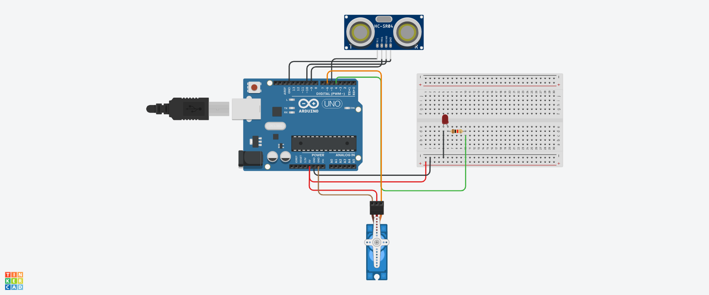

# ROBÔ

#INTRODUÇÃO 

Este projeto foi desenvolvido dentro do tinkercad, na disciplina de Internet das Coisas (IOT), para a criação de um prototipo com arduino que acende o LED e o servo motor move 90 graus 
quando um objeto estiver a menos de 30cm do sensor.

#COMPONENTES USADOS

- 1 Arduino Uno
- 1 Resistor de 1 kOhms
- 1 Placa de Ensaio
- 1 Led
- 11 Jumpers Macho-Macho
- 1 Sensor de distância ultrassônico
- Micro Servo

  #EXPLICAÇÃO DO CÓDIGO

  #include <Servo.h>

  // Inclui a biblioteca Servo para controlar o servo motor

// Definição dos pinos utilizados

const int trigPin = 9; 
const int echoPin = 10; 
const int ledPin = 4; 
const int servoPin = 6;

Servo meuServo; 

void setup() {

  // Configuração dos pinos
  
   pinMode(trigPin, OUTPUT); 
    pinMode(echoPin, INPUT); 
    pinMode(ledPin, OUTPUT); 
    
  meuServo.attach(servoPin); 
    meuServo.write(0); 
    
   // Move o servo para a posição inicial (0 graus)
    
   Serial.begin(9600); 
   
   // Inicializa a comunicação serial a 9600 bps
}

void loop() {

  long duration, distance; // Declara variáveis para duração e distância

   // Envia um pulso ultrassônico

   
  digitalWrite(trigPin, LOW); 
    delayMicroseconds(2); 
    digitalWrite(trigPin, HIGH); 
    delayMicroseconds(10); 
    digitalWrite(trigPin, LOW); 

  // Calcula a distância
  
  uration = pulseIn(echoPin, HIGH);
  
  // Espera pelo eco e obtém a duração
  
   distance = (duration * 0.034) / 2; 
   
   // Calcula a distância em cm
    
  
   Serial.print("Distância: ");
    Serial.println(distance);

  
   if (distance < 30) {
        digitalWrite(ledPin, HIGH); 
         // Acende o LED
        
  meuServo.write(90); 
  // Move o servo para 90 graus
  
   delay(1000); 
   // Aguarda 1 segundo
   
  meuServo.write(0); 
  // Retorna o servo para 0 graus
  
  digitalWrite(ledPin, LOW); 
  // Apaga o LED
    }

  delay(100); 
}

#MONTAGEM DO CIRCUITO

  
