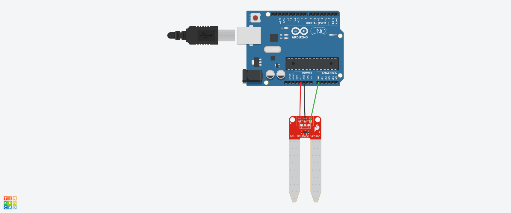

# SENSOR 

#INTRODUÇÃO 

Este projeto foi desenvolvido dentro do tinkercad, na disciplina de Internet das Coisas (IOT), para a criação de um prototipo com arduino que lê 
a umidade do solo usando um sensor analógico.

#COMPONENTES USADOS

- 1 Arduino Uno
- 1 Sensor de umidade do solo
- Jumpers Macho-Macho

 #EXPLICAÇÃO DO CÓDIGO

 

 #include <SoftwareSerial.h>

// BIBLIOTECA PARA CONEXÃO SERIAL DO SENSOR 

//VARIÁVEL DO SENSOR 
	
int sensor = A0;

void setup()
{
  
  //DEFINIR O MOTOR COMO ENTRADA 
  
  pinMode(sensor,INPUT);
  
  //INICIALIZANDO O MONITOR SERIAL 
  
  Serial.begin(9600);
}

void loop()
{
  
  //GUARDAR O VALOR LIDO PELO SENSOR 
  
  int umidade = analogRead(sensor);
  
  //IMPRIMIR VALOR LIDO
  
  if (umidade < 300) {
    Serial.print("umidade do solo");
    
    }
  
   if (umidade < 500) {
    Serial.print("umidade do solo");
     
   }
  
   if (umidade >= 500) {
    Serial.print("umidade do solo");
     
   }
  delay(3000);
  }

#MONTAGEM DO CIRCUITO]

